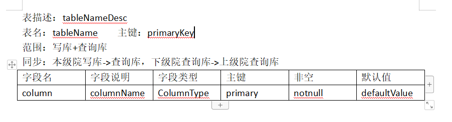
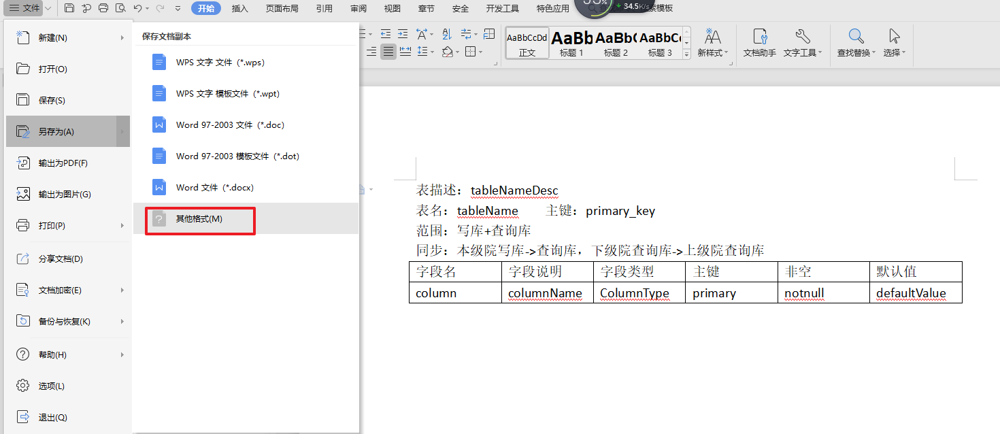
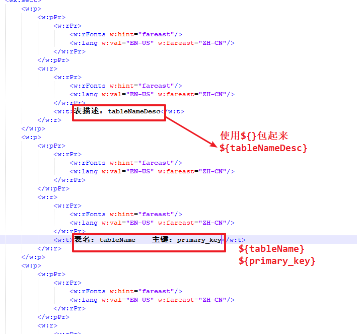
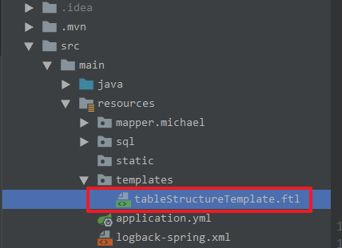
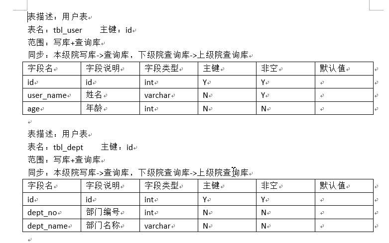

# 将数据库表结构导出为word

需求：在写设计文档时，需要将数据库表结构导出为word文档

步骤：

1、新建word模板如下：



2、将该word模板另存为xml文件：




3、将xml文件中的变量名（tableNameDesc、tableName等）使用${}包起来：



4、将xml文件另存为ftl文件

5、ftl文件中，在需要循环的地方使用：<#list></#list>标签包起来

```xml
<?xml version="1.0" encoding="UTF-8" standalone="yes"?>
<?mso-application progid="Word.Document"?>
<w:wordDocument
        xmlns:w="http://schemas.microsoft.com/office/word/2003/wordml"
        xmlns:v="urn:schemas-microsoft-com:vml"
        xmlns:wx="http://schemas.microsoft.com/office/word/2003/auxHint"
        xmlns:o="urn:schemas-microsoft-com:office:office"
        xmlns:dt="uuid:C2F41010-65B3-11d1-A29F-00AA00C14882" w:macrosPresent="no" w:embeddedObjPresent="no"
        w:ocxPresent="no" xml:space="preserve">
    <o:DocumentProperties>
        <o:Author>xwl</o:Author>
        <o:LastAuthor>余止木</o:LastAuthor>
        <o:Created>2014-10-29T12:08:00Z</o:Created>
        <o:LastSaved>2019-09-18T14:01:27Z</o:LastSaved>
        <o:TotalTime>10080</o:TotalTime>
        <o:Pages>1</o:Pages>
        <o:Words>0</o:Words>
        <o:Characters>0</o:Characters>
        <o:Lines>0</o:Lines>
        <o:Paragraphs>0</o:Paragraphs>
        <o:CharactersWithSpaces>0</o:CharactersWithSpaces>
        <o:Version>14</o:Version>
    </o:DocumentProperties>
    <o:CustomDocumentProperties>
        <o:KSOProductBuildVer dt:dt="string">2052-11.1.0.8907</o:KSOProductBuildVer>
    </o:CustomDocumentProperties>
    <w:fonts>
        <w:defaultFonts w:ascii="Calibri" w:fareast="宋体" w:h-ansi="Calibri" w:cs="Times New Roman"/>
        <w:font w:name="Times New Roman">
            <w:panose-1 w:val="02020603050405020304"/>
            <w:charset w:val="00"/>
            <w:family w:val="Auto"/>
            <w:pitch w:val="Default"/>
            <w:sig w:usb-0="E0002EFF" w:usb-1="C000785B" w:usb-2="00000009" w:usb-3="00000000" w:csb-0="400001FF" w:csb-1="FFFF0000"/>
        </w:font>
        <w:font w:name="宋体">
            <w:panose-1 w:val="02010600030101010101"/>
            <w:charset w:val="86"/>
            <w:family w:val="Auto"/>
            <w:pitch w:val="Default"/>
            <w:sig w:usb-0="00000003" w:usb-1="288F0000" w:usb-2="00000006" w:usb-3="00000000" w:csb-0="00040001" w:csb-1="00000000"/>
        </w:font>
        <w:font w:name="Wingdings">
            <w:panose-1 w:val="05000000000000000000"/>
            <w:charset w:val="02"/>
            <w:family w:val="Auto"/>
            <w:pitch w:val="Default"/>
            <w:sig w:usb-0="00000000" w:usb-1="00000000" w:usb-2="00000000" w:usb-3="00000000" w:csb-0="80000000" w:csb-1="00000000"/>
        </w:font>
        <w:font w:name="Arial">
            <w:panose-1 w:val="020B0604020202020204"/>
            <w:charset w:val="01"/>
            <w:family w:val="SWiss"/>
            <w:pitch w:val="Default"/>
            <w:sig w:usb-0="E0002EFF" w:usb-1="C000785B" w:usb-2="00000009" w:usb-3="00000000" w:csb-0="400001FF" w:csb-1="FFFF0000"/>
        </w:font>
        <w:font w:name="黑体">
            <w:panose-1 w:val="02010609060101010101"/>
            <w:charset w:val="86"/>
            <w:family w:val="Auto"/>
            <w:pitch w:val="Default"/>
            <w:sig w:usb-0="800002BF" w:usb-1="38CF7CFA" w:usb-2="00000016" w:usb-3="00000000" w:csb-0="00040001" w:csb-1="00000000"/>
        </w:font>
        <w:font w:name="Courier New">
            <w:panose-1 w:val="02070309020205020404"/>
            <w:charset w:val="01"/>
            <w:family w:val="Modern"/>
            <w:pitch w:val="Default"/>
            <w:sig w:usb-0="E0002EFF" w:usb-1="C0007843" w:usb-2="00000009" w:usb-3="00000000" w:csb-0="400001FF" w:csb-1="FFFF0000"/>
        </w:font>
        <w:font w:name="Symbol">
            <w:panose-1 w:val="05050102010706020507"/>
            <w:charset w:val="02"/>
            <w:family w:val="Roman"/>
            <w:pitch w:val="Default"/>
            <w:sig w:usb-0="00000000" w:usb-1="00000000" w:usb-2="00000000" w:usb-3="00000000" w:csb-0="80000000" w:csb-1="00000000"/>
        </w:font>
        <w:font w:name="Calibri">
            <w:panose-1 w:val="020F0502020204030204"/>
            <w:charset w:val="00"/>
            <w:family w:val="SWiss"/>
            <w:pitch w:val="Default"/>
            <w:sig w:usb-0="E0002AFF" w:usb-1="C000247B" w:usb-2="00000009" w:usb-3="00000000" w:csb-0="200001FF" w:csb-1="00000000"/>
        </w:font>
        <w:font w:name="微软雅黑">
            <w:panose-1 w:val="020B0503020204020204"/>
            <w:charset w:val="86"/>
            <w:family w:val="Auto"/>
            <w:pitch w:val="Default"/>
            <w:sig w:usb-0="80000287" w:usb-1="2ACF3C50" w:usb-2="00000016" w:usb-3="00000000" w:csb-0="0004001F" w:csb-1="00000000"/>
        </w:font>
        <w:font w:name="Tahoma">
            <w:panose-1 w:val="020B0604030504040204"/>
            <w:charset w:val="00"/>
            <w:family w:val="Auto"/>
            <w:pitch w:val="Default"/>
            <w:sig w:usb-0="E1002EFF" w:usb-1="C000605B" w:usb-2="00000029" w:usb-3="00000000" w:csb-0="200101FF" w:csb-1="20280000"/>
        </w:font>
    </w:fonts>
    <w:styles>
        <w:latentStyles w:defLockedState="off" w:latentStyleCount="260">
            <w:lsdException w:name="Normal"/>
            <w:lsdException w:name="heading 1"/>
            <w:lsdException w:name="heading 2"/>
            <w:lsdException w:name="heading 3"/>
            <w:lsdException w:name="heading 4"/>
            <w:lsdException w:name="heading 5"/>
            <w:lsdException w:name="heading 6"/>
            <w:lsdException w:name="heading 7"/>
            <w:lsdException w:name="heading 8"/>
            <w:lsdException w:name="heading 9"/>
            <w:lsdException w:name="index 1"/>
            <w:lsdException w:name="index 2"/>
            <w:lsdException w:name="index 3"/>
            <w:lsdException w:name="index 4"/>
            <w:lsdException w:name="index 5"/>
            <w:lsdException w:name="index 6"/>
            <w:lsdException w:name="index 7"/>
            <w:lsdException w:name="index 8"/>
            <w:lsdException w:name="index 9"/>
            <w:lsdException w:name="toc 1"/>
            <w:lsdException w:name="toc 2"/>
            <w:lsdException w:name="toc 3"/>
            <w:lsdException w:name="toc 4"/>
            <w:lsdException w:name="toc 5"/>
            <w:lsdException w:name="toc 6"/>
            <w:lsdException w:name="toc 7"/>
            <w:lsdException w:name="toc 8"/>
            <w:lsdException w:name="toc 9"/>
            <w:lsdException w:name="Normal Indent"/>
            <w:lsdException w:name="footnote text"/>
            <w:lsdException w:name="annotation text"/>
            <w:lsdException w:name="header"/>
            <w:lsdException w:name="footer"/>
            <w:lsdException w:name="index heading"/>
            <w:lsdException w:name="caption"/>
            <w:lsdException w:name="table of figures"/>
            <w:lsdException w:name="envelope address"/>
            <w:lsdException w:name="envelope return"/>
            <w:lsdException w:name="footnote reference"/>
            <w:lsdException w:name="annotation reference"/>
            <w:lsdException w:name="line number"/>
            <w:lsdException w:name="page number"/>
            <w:lsdException w:name="endnote reference"/>
            <w:lsdException w:name="endnote text"/>
            <w:lsdException w:name="table of authorities"/>
            <w:lsdException w:name="macro"/>
            <w:lsdException w:name="toa heading"/>
            <w:lsdException w:name="List"/>
            <w:lsdException w:name="List Bullet"/>
            <w:lsdException w:name="List Number"/>
            <w:lsdException w:name="List 2"/>
            <w:lsdException w:name="List 3"/>
            <w:lsdException w:name="List 4"/>
            <w:lsdException w:name="List 5"/>
            <w:lsdException w:name="List Bullet 2"/>
            <w:lsdException w:name="List Bullet 3"/>
            <w:lsdException w:name="List Bullet 4"/>
            <w:lsdException w:name="List Bullet 5"/>
            <w:lsdException w:name="List Number 2"/>
            <w:lsdException w:name="List Number 3"/>
            <w:lsdException w:name="List Number 4"/>
            <w:lsdException w:name="List Number 5"/>
            <w:lsdException w:name="Title"/>
            <w:lsdException w:name="Closing"/>
            <w:lsdException w:name="Signature"/>
            <w:lsdException w:name="Default Paragraph Font"/>
            <w:lsdException w:name="Body Text"/>
            <w:lsdException w:name="Body Text Indent"/>
            <w:lsdException w:name="List Continue"/>
            <w:lsdException w:name="List Continue 2"/>
            <w:lsdException w:name="List Continue 3"/>
            <w:lsdException w:name="List Continue 4"/>
            <w:lsdException w:name="List Continue 5"/>
            <w:lsdException w:name="Message Header"/>
            <w:lsdException w:name="Subtitle"/>
            <w:lsdException w:name="Salutation"/>
            <w:lsdException w:name="Date"/>
            <w:lsdException w:name="Body Text First Indent"/>
            <w:lsdException w:name="Body Text First Indent 2"/>
            <w:lsdException w:name="Note Heading"/>
            <w:lsdException w:name="Body Text 2"/>
            <w:lsdException w:name="Body Text 3"/>
            <w:lsdException w:name="Body Text Indent 2"/>
            <w:lsdException w:name="Body Text Indent 3"/>
            <w:lsdException w:name="Block Text"/>
            <w:lsdException w:name="Hyperlink"/>
            <w:lsdException w:name="FollowedHyperlink"/>
            <w:lsdException w:name="Strong"/>
            <w:lsdException w:name="Emphasis"/>
            <w:lsdException w:name="Document Map"/>
            <w:lsdException w:name="Plain Text"/>
            <w:lsdException w:name="E-mail Signature"/>
            <w:lsdException w:name="Normal (Web)"/>
            <w:lsdException w:name="HTML Acronym"/>
            <w:lsdException w:name="HTML Address"/>
            <w:lsdException w:name="HTML Cite"/>
            <w:lsdException w:name="HTML Code"/>
            <w:lsdException w:name="HTML Definition"/>
            <w:lsdException w:name="HTML Keyboard"/>
            <w:lsdException w:name="HTML Preformatted"/>
            <w:lsdException w:name="HTML Sample"/>
            <w:lsdException w:name="HTML Typewriter"/>
            <w:lsdException w:name="HTML Variable"/>
            <w:lsdException w:name="Normal Table"/>
            <w:lsdException w:name="annotation subject"/>
            <w:lsdException w:name="Table Simple 1"/>
            <w:lsdException w:name="Table Simple 2"/>
            <w:lsdException w:name="Table Simple 3"/>
            <w:lsdException w:name="Table Classic 1"/>
            <w:lsdException w:name="Table Classic 2"/>
            <w:lsdException w:name="Table Classic 3"/>
            <w:lsdException w:name="Table Classic 4"/>
            <w:lsdException w:name="Table Colorful 1"/>
            <w:lsdException w:name="Table Colorful 2"/>
            <w:lsdException w:name="Table Colorful 3"/>
            <w:lsdException w:name="Table Columns 1"/>
            <w:lsdException w:name="Table Columns 2"/>
            <w:lsdException w:name="Table Columns 3"/>
            <w:lsdException w:name="Table Columns 4"/>
            <w:lsdException w:name="Table Columns 5"/>
            <w:lsdException w:name="Table Grid 1"/>
            <w:lsdException w:name="Table Grid 2"/>
            <w:lsdException w:name="Table Grid 3"/>
            <w:lsdException w:name="Table Grid 4"/>
            <w:lsdException w:name="Table Grid 5"/>
            <w:lsdException w:name="Table Grid 6"/>
            <w:lsdException w:name="Table Grid 7"/>
            <w:lsdException w:name="Table Grid 8"/>
            <w:lsdException w:name="Table List 1"/>
            <w:lsdException w:name="Table List 2"/>
            <w:lsdException w:name="Table List 3"/>
            <w:lsdException w:name="Table List 4"/>
            <w:lsdException w:name="Table List 5"/>
            <w:lsdException w:name="Table List 6"/>
            <w:lsdException w:name="Table List 7"/>
            <w:lsdException w:name="Table List 8"/>
            <w:lsdException w:name="Table 3D effects 1"/>
            <w:lsdException w:name="Table 3D effects 2"/>
            <w:lsdException w:name="Table 3D effects 3"/>
            <w:lsdException w:name="Table Contemporary"/>
            <w:lsdException w:name="Table Elegant"/>
            <w:lsdException w:name="Table Professional"/>
            <w:lsdException w:name="Table Subtle 1"/>
            <w:lsdException w:name="Table Subtle 2"/>
            <w:lsdException w:name="Table Web 1"/>
            <w:lsdException w:name="Table Web 2"/>
            <w:lsdException w:name="Table Web 3"/>
            <w:lsdException w:name="Balloon Text"/>
            <w:lsdException w:name="Table Grid"/>
            <w:lsdException w:name="Table Theme"/>
            <w:lsdException w:name="Light Shading"/>
            <w:lsdException w:name="Light List"/>
            <w:lsdException w:name="Light Grid"/>
            <w:lsdException w:name="Medium Shading 1"/>
            <w:lsdException w:name="Medium Shading 2"/>
            <w:lsdException w:name="Medium List 1"/>
            <w:lsdException w:name="Medium List 2"/>
            <w:lsdException w:name="Medium Grid 1"/>
            <w:lsdException w:name="Medium Grid 2"/>
            <w:lsdException w:name="Medium Grid 3"/>
            <w:lsdException w:name="Dark List"/>
            <w:lsdException w:name="Colorful Shading"/>
            <w:lsdException w:name="Colorful List"/>
            <w:lsdException w:name="Colorful Grid"/>
            <w:lsdException w:name="Light Shading Accent 1"/>
            <w:lsdException w:name="Light List Accent 1"/>
            <w:lsdException w:name="Light Grid Accent 1"/>
            <w:lsdException w:name="Medium Shading 1 Accent 1"/>
            <w:lsdException w:name="Medium Shading 2 Accent 1"/>
            <w:lsdException w:name="Medium List 1 Accent 1"/>
            <w:lsdException w:name="Medium List 2 Accent 1"/>
            <w:lsdException w:name="Medium Grid 1 Accent 1"/>
            <w:lsdException w:name="Medium Grid 2 Accent 1"/>
            <w:lsdException w:name="Medium Grid 3 Accent 1"/>
            <w:lsdException w:name="Dark List Accent 1"/>
            <w:lsdException w:name="Colorful Shading Accent 1"/>
            <w:lsdException w:name="Colorful List Accent 1"/>
            <w:lsdException w:name="Colorful Grid Accent 1"/>
            <w:lsdException w:name="Light Shading Accent 2"/>
            <w:lsdException w:name="Light List Accent 2"/>
            <w:lsdException w:name="Light Grid Accent 2"/>
            <w:lsdException w:name="Medium Shading 1 Accent 2"/>
            <w:lsdException w:name="Medium Shading 2 Accent 2"/>
            <w:lsdException w:name="Medium List 1 Accent 2"/>
            <w:lsdException w:name="Medium List 2 Accent 2"/>
            <w:lsdException w:name="Medium Grid 1 Accent 2"/>
            <w:lsdException w:name="Medium Grid 2 Accent 2"/>
            <w:lsdException w:name="Medium Grid 3 Accent 2"/>
            <w:lsdException w:name="Dark List Accent 2"/>
            <w:lsdException w:name="Colorful Shading Accent 2"/>
            <w:lsdException w:name="Colorful List Accent 2"/>
            <w:lsdException w:name="Colorful Grid Accent 2"/>
            <w:lsdException w:name="Light Shading Accent 3"/>
            <w:lsdException w:name="Light List Accent 3"/>
            <w:lsdException w:name="Light Grid Accent 3"/>
            <w:lsdException w:name="Medium Shading 1 Accent 3"/>
            <w:lsdException w:name="Medium Shading 2 Accent 3"/>
            <w:lsdException w:name="Medium List 1 Accent 3"/>
            <w:lsdException w:name="Medium List 2 Accent 3"/>
            <w:lsdException w:name="Medium Grid 1 Accent 3"/>
            <w:lsdException w:name="Medium Grid 2 Accent 3"/>
            <w:lsdException w:name="Medium Grid 3 Accent 3"/>
            <w:lsdException w:name="Dark List Accent 3"/>
            <w:lsdException w:name="Colorful Shading Accent 3"/>
            <w:lsdException w:name="Colorful List Accent 3"/>
            <w:lsdException w:name="Colorful Grid Accent 3"/>
            <w:lsdException w:name="Light Shading Accent 4"/>
            <w:lsdException w:name="Light List Accent 4"/>
            <w:lsdException w:name="Light Grid Accent 4"/>
            <w:lsdException w:name="Medium Shading 1 Accent 4"/>
            <w:lsdException w:name="Medium Shading 2 Accent 4"/>
            <w:lsdException w:name="Medium List 1 Accent 4"/>
            <w:lsdException w:name="Medium List 2 Accent 4"/>
            <w:lsdException w:name="Medium Grid 1 Accent 4"/>
            <w:lsdException w:name="Medium Grid 2 Accent 4"/>
            <w:lsdException w:name="Medium Grid 3 Accent 4"/>
            <w:lsdException w:name="Dark List Accent 4"/>
            <w:lsdException w:name="Colorful Shading Accent 4"/>
            <w:lsdException w:name="Colorful List Accent 4"/>
            <w:lsdException w:name="Colorful Grid Accent 4"/>
            <w:lsdException w:name="Light Shading Accent 5"/>
            <w:lsdException w:name="Light List Accent 5"/>
            <w:lsdException w:name="Light Grid Accent 5"/>
            <w:lsdException w:name="Medium Shading 1 Accent 5"/>
            <w:lsdException w:name="Medium Shading 2 Accent 5"/>
            <w:lsdException w:name="Medium List 1 Accent 5"/>
            <w:lsdException w:name="Medium List 2 Accent 5"/>
            <w:lsdException w:name="Medium Grid 1 Accent 5"/>
            <w:lsdException w:name="Medium Grid 2 Accent 5"/>
            <w:lsdException w:name="Medium Grid 3 Accent 5"/>
            <w:lsdException w:name="Dark List Accent 5"/>
            <w:lsdException w:name="Colorful Shading Accent 5"/>
            <w:lsdException w:name="Colorful List Accent 5"/>
            <w:lsdException w:name="Colorful Grid Accent 5"/>
            <w:lsdException w:name="Light Shading Accent 6"/>
            <w:lsdException w:name="Light List Accent 6"/>
            <w:lsdException w:name="Light Grid Accent 6"/>
            <w:lsdException w:name="Medium Shading 1 Accent 6"/>
            <w:lsdException w:name="Medium Shading 2 Accent 6"/>
            <w:lsdException w:name="Medium List 1 Accent 6"/>
            <w:lsdException w:name="Medium List 2 Accent 6"/>
            <w:lsdException w:name="Medium Grid 1 Accent 6"/>
            <w:lsdException w:name="Medium Grid 2 Accent 6"/>
            <w:lsdException w:name="Medium Grid 3 Accent 6"/>
            <w:lsdException w:name="Dark List Accent 6"/>
            <w:lsdException w:name="Colorful Shading Accent 6"/>
            <w:lsdException w:name="Colorful List Accent 6"/>
            <w:lsdException w:name="Colorful Grid Accent 6"/>
        </w:latentStyles>
        <w:style w:type="paragraph" w:styleId="a1" w:default="on">
            <w:name w:val="Normal"/>
            <w:pPr>
                <w:widowControl w:val="off"/>
                <w:jc w:val="both"/>
            </w:pPr>
            <w:rPr>
                <w:rFonts w:ascii="Calibri" w:h-ansi="Calibri" w:fareast="宋体" w:cs="Times New Roman" w:hint="default"/>
                <w:kern w:val="2"/>
                <w:sz w:val="21"/>
                <w:sz-cs w:val="24"/>
                <w:lang w:val="EN-US" w:fareast="ZH-CN"/>
            </w:rPr>
        </w:style>
        <w:style w:type="character" w:styleId="a4" w:default="on">
            <w:name w:val="Default Paragraph Font"/>
            <w:semiHidden/>
        </w:style>
        <w:style w:type="table" w:styleId="a2" w:default="on">
            <w:name w:val="Normal Table"/>
            <w:semiHidden/>
            <w:tblPr>
                <w:tblCellMar>
                    <w:top w:w="0" w:type="dxa"/>
                    <w:left w:w="108" w:type="dxa"/>
                    <w:bottom w:w="0" w:type="dxa"/>
                    <w:right w:w="108" w:type="dxa"/>
                </w:tblCellMar>
            </w:tblPr>
        </w:style>
        <w:style w:type="table" w:styleId="a3">
            <w:name w:val="Table Grid"/>
            <w:basedOn w:val="a2"/>
            <w:pPr>
                <w:pStyle w:val="a2"/>
                <w:widowControl w:val="off"/>
                <w:jc w:val="both"/>
            </w:pPr>
            <w:tblPr>
                <w:tblBorders>
                    <w:top w:val="single" w:sz="4" wx:bdrwidth="10" w:space="0" w:color="auto"/>
                    <w:left w:val="single" w:sz="4" wx:bdrwidth="10" w:space="0" w:color="auto"/>
                    <w:bottom w:val="single" w:sz="4" wx:bdrwidth="10" w:space="0" w:color="auto"/>
                    <w:right w:val="single" w:sz="4" wx:bdrwidth="10" w:space="0" w:color="auto"/>
                    <w:insideH w:val="single" w:sz="4" wx:bdrwidth="10" w:space="0" w:color="auto"/>
                    <w:insideV w:val="single" w:sz="4" wx:bdrwidth="10" w:space="0" w:color="auto"/>
                </w:tblBorders>
            </w:tblPr>
        </w:style>
    </w:styles>
    <w:bgPict>
        <w:background/>
        <v:background id="_x0000_s1025">
            <v:fill on="f" focussize="0,0"/>
        </v:background>
    </w:bgPict>
    <w:docPr>
        <w:view w:val="print"/>
        <w:zoom w:val="bestFit" w:percent="167"/>
        <w:characterSpacingControl w:val="CompressPunctuation"/>
        <w:documentProtection w:enforcement="off"/>
        <w:punctuationKerning/>
        <w:doNotEmbedSystemFonts/>
        <w:bordersDontSurroundHeader/>
        <w:bordersDontSurroundFooter/>
        <w:defaultTabStop w:val="420"/>
        <w:drawingGridVerticalSpacing w:val="156"/>
        <w:displayHorizontalDrawingGridEvery w:val="0"/>
        <w:displayVerticalDrawingGridEvery w:val="2"/>
        <w:compat>
            <w:adjustLineHeightInTable/>
            <w:ulTrailSpace/>
            <w:doNotExpandShiftReturn/>
            <w:balanceSingleByteDoubleByteWidth/>
            <w:useFELayout/>
            <w:spaceForUL/>
            <w:wrapTextWithPunct/>
            <w:breakWrappedTables/>
            <w:useAsianBreakRules/>
            <w:dontGrowAutofit/>
            <w:useFELayout/>
        </w:compat>
    </w:docPr>
    <w:body>

        <#list listmap as maps>
        <wx:sect>
            <w:p>
                <w:pPr>
                    <w:rPr>
                        <w:rFonts w:hint="fareast"/>
                        <w:lang w:val="EN-US" w:fareast="ZH-CN"/>
                    </w:rPr>
                </w:pPr>
                <w:r>
                    <w:rPr>
                        <w:rFonts w:hint="fareast"/>
                        <w:lang w:val="EN-US" w:fareast="ZH-CN"/>
                    </w:rPr>
                    <w:t>表描述：${maps.tableNameDesc}</w:t>
                </w:r>
            </w:p>
            <w:p>
                <w:pPr>
                    <w:rPr>
                        <w:rFonts w:hint="fareast"/>
                        <w:lang w:val="EN-US" w:fareast="ZH-CN"/>
                    </w:rPr>
                </w:pPr>
                <w:r>
                    <w:rPr>
                        <w:rFonts w:hint="fareast"/>
                        <w:lang w:val="EN-US" w:fareast="ZH-CN"/>
                    </w:rPr>
                    <w:t>表名：${maps.tableName}    主键：${maps.primary_key}</w:t>
                </w:r>
            </w:p>
            <w:p>
                <w:pPr>
                    <w:rPr>
                        <w:rFonts w:hint="fareast"/>
                        <w:lang w:val="EN-US" w:fareast="ZH-CN"/>
                    </w:rPr>
                </w:pPr>
                <w:r>
                    <w:rPr>
                        <w:rFonts w:hint="fareast"/>
                        <w:lang w:val="EN-US" w:fareast="ZH-CN"/>
                    </w:rPr>
                    <w:t>范围：写库+查询库</w:t>
                </w:r>
            </w:p>
            <w:p>
                <w:pPr>
                    <w:rPr>
                        <w:rFonts w:hint="fareast"/>
                        <w:lang w:val="EN-US" w:fareast="ZH-CN"/>
                    </w:rPr>
                </w:pPr>
                <w:r>
                    <w:rPr>
                        <w:rFonts w:hint="fareast"/>
                        <w:lang w:val="EN-US" w:fareast="ZH-CN"/>
                    </w:rPr>
                    <w:t>同步：本级院写库-&gt;查询库，下级院查询库-&gt;上级院查询库</w:t>
                </w:r>
            </w:p>
            <w:tbl>
                <w:tblPr>
                    <w:tblStyle w:val="a3"/>
                    <w:tblW w:w="8522" w:type="dxa"/>
                    <w:tblInd w:w="0" w:type="dxa"/>
                    <w:tblBorders>
                        <w:top w:val="single" w:sz="4" wx:bdrwidth="10" w:space="0" w:color="auto"/>
                        <w:left w:val="single" w:sz="4" wx:bdrwidth="10" w:space="0" w:color="auto"/>
                        <w:bottom w:val="single" w:sz="4" wx:bdrwidth="10" w:space="0" w:color="auto"/>
                        <w:right w:val="single" w:sz="4" wx:bdrwidth="10" w:space="0" w:color="auto"/>
                        <w:insideH w:val="single" w:sz="4" wx:bdrwidth="10" w:space="0" w:color="auto"/>
                        <w:insideV w:val="single" w:sz="4" wx:bdrwidth="10" w:space="0" w:color="auto"/>
                    </w:tblBorders>
                    <w:tblLayout w:type="Fixed"/>
                    <w:tblCellMar>
                        <w:left w:w="108" w:type="dxa"/>
                        <w:right w:w="108" w:type="dxa"/>
                    </w:tblCellMar>
                </w:tblPr>
                <w:tblGrid>
                    <w:gridCol w:w="1420"/>
                    <w:gridCol w:w="1420"/>
                    <w:gridCol w:w="1420"/>
                    <w:gridCol w:w="1420"/>
                    <w:gridCol w:w="1421"/>
                    <w:gridCol w:w="1421"/>
                </w:tblGrid>
                <w:tr>
                    <w:tblPrEx>
                        <w:tblBorders>
                            <w:top w:val="single" w:sz="4" wx:bdrwidth="10" w:space="0" w:color="auto"/>
                            <w:left w:val="single" w:sz="4" wx:bdrwidth="10" w:space="0" w:color="auto"/>
                            <w:bottom w:val="single" w:sz="4" wx:bdrwidth="10" w:space="0" w:color="auto"/>
                            <w:right w:val="single" w:sz="4" wx:bdrwidth="10" w:space="0" w:color="auto"/>
                            <w:insideH w:val="single" w:sz="4" wx:bdrwidth="10" w:space="0" w:color="auto"/>
                            <w:insideV w:val="single" w:sz="4" wx:bdrwidth="10" w:space="0" w:color="auto"/>
                        </w:tblBorders>
                        <w:tblCellMar>
                            <w:left w:w="108" w:type="dxa"/>
                            <w:right w:w="108" w:type="dxa"/>
                        </w:tblCellMar>
                    </w:tblPrEx>
                    <w:trPr/>
                    <w:tc>
                        <w:tcPr>
                            <w:tcW w:w="1420" w:type="dxa"/>
                            <w:shd w:val="clear" w:color="auto" w:fill="auto"/>
                            <w:noWrap w:val="0"/>
                            <w:vAlign w:val="top"/>
                        </w:tcPr>
                        <w:p>
                            <w:pPr>
                                <w:rPr>
                                    <w:rFonts w:hint="default"/>
                                    <w:vertAlign w:val="baseline"/>
                                    <w:lang w:val="EN-US" w:fareast="ZH-CN"/>
                                </w:rPr>
                            </w:pPr>
                            <w:r>
                                <w:rPr>
                                    <w:rFonts w:hint="fareast"/>
                                    <w:vertAlign w:val="baseline"/>
                                    <w:lang w:val="EN-US" w:fareast="ZH-CN"/>
                                </w:rPr>
                                <w:t>字段名</w:t>
                            </w:r>
                        </w:p>
                    </w:tc>
                    <w:tc>
                        <w:tcPr>
                            <w:tcW w:w="1420" w:type="dxa"/>
                            <w:shd w:val="clear" w:color="auto" w:fill="auto"/>
                            <w:noWrap w:val="0"/>
                            <w:vAlign w:val="top"/>
                        </w:tcPr>
                        <w:p>
                            <w:pPr>
                                <w:rPr>
                                    <w:rFonts w:hint="default"/>
                                    <w:vertAlign w:val="baseline"/>
                                    <w:lang w:val="EN-US" w:fareast="ZH-CN"/>
                                </w:rPr>
                            </w:pPr>
                            <w:r>
                                <w:rPr>
                                    <w:rFonts w:hint="fareast"/>
                                    <w:vertAlign w:val="baseline"/>
                                    <w:lang w:val="EN-US" w:fareast="ZH-CN"/>
                                </w:rPr>
                                <w:t>字段说明</w:t>
                            </w:r>
                        </w:p>
                    </w:tc>
                    <w:tc>
                        <w:tcPr>
                            <w:tcW w:w="1420" w:type="dxa"/>
                            <w:shd w:val="clear" w:color="auto" w:fill="auto"/>
                            <w:noWrap w:val="0"/>
                            <w:vAlign w:val="top"/>
                        </w:tcPr>
                        <w:p>
                            <w:pPr>
                                <w:rPr>
                                    <w:rFonts w:hint="default"/>
                                    <w:vertAlign w:val="baseline"/>
                                    <w:lang w:val="EN-US" w:fareast="ZH-CN"/>
                                </w:rPr>
                            </w:pPr>
                            <w:r>
                                <w:rPr>
                                    <w:rFonts w:hint="fareast"/>
                                    <w:vertAlign w:val="baseline"/>
                                    <w:lang w:val="EN-US" w:fareast="ZH-CN"/>
                                </w:rPr>
                                <w:t>字段类型</w:t>
                            </w:r>
                        </w:p>
                    </w:tc>
                    <w:tc>
                        <w:tcPr>
                            <w:tcW w:w="1420" w:type="dxa"/>
                            <w:shd w:val="clear" w:color="auto" w:fill="auto"/>
                            <w:noWrap w:val="0"/>
                            <w:vAlign w:val="top"/>
                        </w:tcPr>
                        <w:p>
                            <w:pPr>
                                <w:rPr>
                                    <w:rFonts w:hint="default"/>
                                    <w:vertAlign w:val="baseline"/>
                                    <w:lang w:val="EN-US" w:fareast="ZH-CN"/>
                                </w:rPr>
                            </w:pPr>
                            <w:r>
                                <w:rPr>
                                    <w:rFonts w:hint="fareast"/>
                                    <w:vertAlign w:val="baseline"/>
                                    <w:lang w:val="EN-US" w:fareast="ZH-CN"/>
                                </w:rPr>
                                <w:t>主键</w:t>
                            </w:r>
                        </w:p>
                    </w:tc>
                    <w:tc>
                        <w:tcPr>
                            <w:tcW w:w="1421" w:type="dxa"/>
                            <w:shd w:val="clear" w:color="auto" w:fill="auto"/>
                            <w:noWrap w:val="0"/>
                            <w:vAlign w:val="top"/>
                        </w:tcPr>
                        <w:p>
                            <w:pPr>
                                <w:rPr>
                                    <w:rFonts w:hint="default"/>
                                    <w:vertAlign w:val="baseline"/>
                                    <w:lang w:val="EN-US" w:fareast="ZH-CN"/>
                                </w:rPr>
                            </w:pPr>
                            <w:r>
                                <w:rPr>
                                    <w:rFonts w:hint="fareast"/>
                                    <w:vertAlign w:val="baseline"/>
                                    <w:lang w:val="EN-US" w:fareast="ZH-CN"/>
                                </w:rPr>
                                <w:t>非空</w:t>
                            </w:r>
                        </w:p>
                    </w:tc>
                    <w:tc>
                        <w:tcPr>
                            <w:tcW w:w="1421" w:type="dxa"/>
                            <w:shd w:val="clear" w:color="auto" w:fill="auto"/>
                            <w:noWrap w:val="0"/>
                            <w:vAlign w:val="top"/>
                        </w:tcPr>
                        <w:p>
                            <w:pPr>
                                <w:rPr>
                                    <w:rFonts w:hint="default"/>
                                    <w:vertAlign w:val="baseline"/>
                                    <w:lang w:val="EN-US" w:fareast="ZH-CN"/>
                                </w:rPr>
                            </w:pPr>
                            <w:r>
                                <w:rPr>
                                    <w:rFonts w:hint="fareast"/>
                                    <w:vertAlign w:val="baseline"/>
                                    <w:lang w:val="EN-US" w:fareast="ZH-CN"/>
                                </w:rPr>
                                <w:t>默认值</w:t>
                            </w:r>
                        </w:p>
                    </w:tc>
                </w:tr>

                <#list maps.tables as tables>

                <w:tr>
                    <w:tblPrEx>
                        <w:tblBorders>
                            <w:top w:val="single" w:sz="4" wx:bdrwidth="10" w:space="0" w:color="auto"/>
                            <w:left w:val="single" w:sz="4" wx:bdrwidth="10" w:space="0" w:color="auto"/>
                            <w:bottom w:val="single" w:sz="4" wx:bdrwidth="10" w:space="0" w:color="auto"/>
                            <w:right w:val="single" w:sz="4" wx:bdrwidth="10" w:space="0" w:color="auto"/>
                            <w:insideH w:val="single" w:sz="4" wx:bdrwidth="10" w:space="0" w:color="auto"/>
                            <w:insideV w:val="single" w:sz="4" wx:bdrwidth="10" w:space="0" w:color="auto"/>
                        </w:tblBorders>
                        <w:tblCellMar>
                            <w:left w:w="108" w:type="dxa"/>
                            <w:right w:w="108" w:type="dxa"/>
                        </w:tblCellMar>
                    </w:tblPrEx>
                    <w:trPr/>
                    <w:tc>
                        <w:tcPr>
                            <w:tcW w:w="1420" w:type="dxa"/>
                            <w:shd w:val="clear" w:color="auto" w:fill="auto"/>
                            <w:noWrap w:val="0"/>
                            <w:vAlign w:val="top"/>
                        </w:tcPr>
                        <w:p>
                            <w:pPr>
                                <w:rPr>
                                    <w:rFonts w:hint="default"/>
                                    <w:vertAlign w:val="baseline"/>
                                    <w:lang w:val="EN-US" w:fareast="ZH-CN"/>
                                </w:rPr>
                            </w:pPr>
                            <w:r>
                                <w:rPr>
                                    <w:rFonts w:hint="fareast"/>
                                    <w:vertAlign w:val="baseline"/>
                                    <w:lang w:val="EN-US" w:fareast="ZH-CN"/>
                                </w:rPr>
                                <w:t>${tables.column}</w:t>
                            </w:r>
                        </w:p>
                    </w:tc>
                    <w:tc>
                        <w:tcPr>
                            <w:tcW w:w="1420" w:type="dxa"/>
                            <w:shd w:val="clear" w:color="auto" w:fill="auto"/>
                            <w:noWrap w:val="0"/>
                            <w:vAlign w:val="top"/>
                        </w:tcPr>
                        <w:p>
                            <w:pPr>
                                <w:rPr>
                                    <w:rFonts w:hint="default"/>
                                    <w:vertAlign w:val="baseline"/>
                                    <w:lang w:val="EN-US" w:fareast="ZH-CN"/>
                                </w:rPr>
                            </w:pPr>
                            <w:r>
                                <w:rPr>
                                    <w:rFonts w:hint="fareast"/>
                                    <w:vertAlign w:val="baseline"/>
                                    <w:lang w:val="EN-US" w:fareast="ZH-CN"/>
                                </w:rPr>
                                <w:t>${tables.columnName}</w:t>
                            </w:r>
                        </w:p>
                    </w:tc>
                    <w:tc>
                        <w:tcPr>
                            <w:tcW w:w="1420" w:type="dxa"/>
                            <w:shd w:val="clear" w:color="auto" w:fill="auto"/>
                            <w:noWrap w:val="0"/>
                            <w:vAlign w:val="top"/>
                        </w:tcPr>
                        <w:p>
                            <w:pPr>
                                <w:rPr>
                                    <w:rFonts w:hint="default"/>
                                    <w:vertAlign w:val="baseline"/>
                                    <w:lang w:val="EN-US" w:fareast="ZH-CN"/>
                                </w:rPr>
                            </w:pPr>
                            <w:r>
                                <w:rPr>
                                    <w:rFonts w:hint="fareast"/>
                                    <w:vertAlign w:val="baseline"/>
                                    <w:lang w:val="EN-US" w:fareast="ZH-CN"/>
                                </w:rPr>
                                <w:t>${tables.columnType}</w:t>
                            </w:r>
                        </w:p>
                    </w:tc>
                    <w:tc>
                        <w:tcPr>
                            <w:tcW w:w="1420" w:type="dxa"/>
                            <w:shd w:val="clear" w:color="auto" w:fill="auto"/>
                            <w:noWrap w:val="0"/>
                            <w:vAlign w:val="top"/>
                        </w:tcPr>
                        <w:p>
                            <w:pPr>
                                <w:rPr>
                                    <w:rFonts w:hint="default"/>
                                    <w:vertAlign w:val="baseline"/>
                                    <w:lang w:val="EN-US" w:fareast="ZH-CN"/>
                                </w:rPr>
                            </w:pPr>
                            <w:r>
                                <w:rPr>
                                    <w:rFonts w:hint="fareast"/>
                                    <w:vertAlign w:val="baseline"/>
                                    <w:lang w:val="EN-US" w:fareast="ZH-CN"/>
                                </w:rPr>
                                <w:t>${tables.primary}</w:t>
                            </w:r>
                        </w:p>
                    </w:tc>
                    <w:tc>
                        <w:tcPr>
                            <w:tcW w:w="1421" w:type="dxa"/>
                            <w:shd w:val="clear" w:color="auto" w:fill="auto"/>
                            <w:noWrap w:val="0"/>
                            <w:vAlign w:val="top"/>
                        </w:tcPr>
                        <w:p>
                            <w:pPr>
                                <w:rPr>
                                    <w:rFonts w:hint="default"/>
                                    <w:vertAlign w:val="baseline"/>
                                    <w:lang w:val="EN-US" w:fareast="ZH-CN"/>
                                </w:rPr>
                            </w:pPr>
                            <w:r>
                                <w:rPr>
                                    <w:rFonts w:hint="fareast"/>
                                    <w:vertAlign w:val="baseline"/>
                                    <w:lang w:val="EN-US" w:fareast="ZH-CN"/>
                                </w:rPr>
                                <w:t>${tables.notnull}</w:t>
                            </w:r>
                        </w:p>
                    </w:tc>
                    <w:tc>
                        <w:tcPr>
                            <w:tcW w:w="1421" w:type="dxa"/>
                            <w:shd w:val="clear" w:color="auto" w:fill="auto"/>
                            <w:noWrap w:val="0"/>
                            <w:vAlign w:val="top"/>
                        </w:tcPr>
                        <w:p>
                            <w:pPr>
                                <w:rPr>
                                    <w:rFonts w:hint="default"/>
                                    <w:vertAlign w:val="baseline"/>
                                    <w:lang w:val="EN-US" w:fareast="ZH-CN"/>
                                </w:rPr>
                            </w:pPr>
                            <w:r>
                                <w:rPr>
                                    <w:rFonts w:hint="fareast"/>
                                    <w:vertAlign w:val="baseline"/>
                                    <w:lang w:val="EN-US" w:fareast="ZH-CN"/>
                                </w:rPr>
                                <w:t>${tables.defaultVal}</w:t>
                            </w:r>
                        </w:p>
                    </w:tc>
                </w:tr>


                </#list>

            </w:tbl>
            <w:p>
                <w:pPr>
                    <w:rPr>
                        <w:rFonts w:hint="default"/>
                        <w:lang w:val="EN-US" w:fareast="ZH-CN"/>
                    </w:rPr>
                </w:pPr>
            </w:p>
            <w:sectPr>
                <w:pgSz w:w="11906" w:h="16838"/>
                <w:pgMar w:top="1440" w:right="1800" w:bottom="1440" w:left="1800" w:header="851" w:footer="992" w:gutter="0"/>
                <w:cols w:space="720"/>
                <w:docGrid w:type="lines" w:line-pitch="312"/>
            </w:sectPr>
        </wx:sect>

        </#list>
    </w:body>
</w:wordDocument>
```

6、将此ftl模板放在resources/templates目录下



7、新建两个java bean

AllTables：

```java
package com.xwl.prisonbreak.common.util.tableStructure2word;


import io.swagger.annotations.ApiModelProperty;
import lombok.AllArgsConstructor;
import lombok.Data;
import lombok.NoArgsConstructor;

import java.util.List;

/**
 * @Author: xwl
 * @Date: 2019/9/19 9:16
 * @Description: 表描述信息
 */
@Data
@NoArgsConstructor
@AllArgsConstructor
public class AllTables {
    @ApiModelProperty(name = "tableNameDesc", value = "表名描述")
    private String tableNameDesc;

    @ApiModelProperty(name = "tableName", value = "表名")
    private String tableName;

    @ApiModelProperty(name = "primaryKey", value = "主键（复合主键之间用、连接）")
    private String primaryKey;

    @ApiModelProperty(name = "tables", value = "数据表")
    private List<TableStructure> tables;
}

```

TableStructure：

```java
package com.xwl.prisonbreak.common.util.tableStructure2word;

import io.swagger.annotations.ApiModelProperty;
import lombok.AllArgsConstructor;
import lombok.Data;
import lombok.NoArgsConstructor;

/**
 * @Author: xwl
 * @Date: 2019/9/19 9:20
 * @Description: 表结构
 */
@Data
@NoArgsConstructor
@AllArgsConstructor
public class TableStructure {
    @ApiModelProperty(name = "tableName", value = "表名")
    private String tableName;

    @ApiModelProperty(name = "tableNameDesc", value = "表名描述")
    private String tableNameDesc;

    @ApiModelProperty(name = "column", value = "列")
    private String column;

    @ApiModelProperty(name = "columnName", value = "列名")
    private String columnName;

    @ApiModelProperty(name = "columnType", value = "字段类型")
    private String columnType;

    @ApiModelProperty(name = "primary", value = "是否主键：Y/N")
    private String primary;

    @ApiModelProperty(name = "notnull", value = "是否可为空:Y/N")
    private String notnull;

    @ApiModelProperty(name = "defaultVal", value = "默认值")
    private String defaultVal;
}

```

8、关键代码：freemark模板引擎生成word

```java
package com.xwl.prisonbreak.common.util.tableStructure2word;

import freemarker.template.Configuration;
import freemarker.template.Template;

import java.io.*;
import java.util.HashMap;
import java.util.Map;

/**
 * @Author: xwl
 * @Date: 2019/9/19 9:29
 * @Description: 根据模板生成word
 */
public class Template2WordGeneratorUtil {

    private Template2WordGeneratorUtil() {
        throw new AssertionError();
    }

    public static File createDoc(Map<?, ?> dataMap) {
        Configuration configuration = new Configuration(Configuration.VERSION_2_3_28);
        configuration.setDefaultEncoding("utf-8");
        configuration.setClassForTemplateLoading(Template2WordGeneratorUtil.class, "/templates");
        Map<String, Template> allTemplates = new HashMap<>();
        try {
            allTemplates.put("tableStructureTemplate", configuration.getTemplate("tableStructureTemplate.ftl"));
        } catch (IOException e) {
            e.printStackTrace();
            throw new RuntimeException(e);
        }

        String name = "temp" + (int) (Math.random() * 100000) + ".doc";
        File file = new File(name);
        Template template = allTemplates.get("tableStructureTemplate");
        try {
            // 这个地方不能使用FileWriter因为需要指定编码类型否则生成的Word文档会因为有无法识别的编码而无法打开
            Writer writer = new OutputStreamWriter(new FileOutputStream(file), "utf-8");
            template.process(dataMap, writer);
            writer.close();
        } catch (Exception ex) {
            ex.printStackTrace();
            throw new RuntimeException(ex);
        }
        return file;
    }
}

```

9、生成word

```java
package com.xwl.prisonbreak.michael.controller;

import com.xwl.prisonbreak.common.util.tableStructure2word.AllTables;
import com.xwl.prisonbreak.common.util.tableStructure2word.TableStructure;
import com.xwl.prisonbreak.common.util.tableStructure2word.Template2WordGeneratorUtil;
import com.xwl.prisonbreak.michael.mapper.TableStructureMapper;
import io.swagger.annotations.Api;
import io.swagger.annotations.ApiOperation;
import org.apache.commons.lang3.StringUtils;
import org.springframework.beans.factory.annotation.Autowired;
import org.springframework.web.bind.annotation.GetMapping;
import org.springframework.web.bind.annotation.RequestMapping;
import org.springframework.web.bind.annotation.RestController;

import javax.servlet.ServletOutputStream;
import javax.servlet.http.HttpServletRequest;
import javax.servlet.http.HttpServletResponse;
import java.io.File;
import java.io.FileInputStream;
import java.io.IOException;
import java.io.InputStream;
import java.util.ArrayList;
import java.util.HashMap;
import java.util.List;
import java.util.Map;
import java.util.stream.Collectors;

import static java.util.stream.Collectors.groupingBy;


@RestController
@RequestMapping("/api/tableStrToWord")
@Api(tags = "表结构导出为word")
public class TableStructure2WordController {

    @Autowired
    TableStructureMapper tableStructureMapper;

    @GetMapping("/export")
    @ApiOperation("导出为word")
    public void download(HttpServletRequest req, HttpServletResponse resp) throws IOException {
        req.setCharacterEncoding("utf-8");
        Map<String, List<AllTables>> resMap = new HashMap<>();
        List<AllTables> allTablesList = new ArrayList<>();
        // 从数据库查询出的数据
//        List<TableStructure> tableStrList = tableStructureMapper.listTableStructure();

        // 模拟数据
        List<TableStructure> tableStrList = new ArrayList<>();
        tableStrList.add(new TableStructure("tbl_user", "用户表", "id", "id", "int", "Y", "Y", ""));
        tableStrList.add(new TableStructure("tbl_user", "用户表", "user_name", "姓名", "varchar", "N", "Y", ""));
        tableStrList.add(new TableStructure("tbl_user", "用户表", "age", "年龄", "int", "N", "N", ""));
        tableStrList.add(new TableStructure("tbl_dept", "用户表", "id", "id", "int", "Y", "Y", ""));
        tableStrList.add(new TableStructure("tbl_dept", "用户表", "dept_no", "部门编号", "int", "N", "N", ""));
        tableStrList.add(new TableStructure("tbl_dept", "用户表", "dept_name", "部门名称", "varchar", "N", "N", ""));

        Map<String, List<TableStructure>> collect = tableStrList.stream()
                .collect(groupingBy(TableStructure::getTableName));

        for (Map.Entry<String, List<TableStructure>> map : collect.entrySet()) {
            String tableName = map.getKey();
            List<TableStructure> tableStrs = map.getValue();

            // 筛选出主键
            List<String> primaryKeys = tableStrs.stream().filter(item -> StringUtils.equals(item.getPrimary(), "Y"))
                    .map(TableStructure::getColumn)
                    .collect(Collectors.toList());

            // 复合主键之间适用、连接
            StringBuilder sb = new StringBuilder();
            for (String primaryKey : primaryKeys) {
                sb.append(primaryKey).append("、");
            }
            String primaryKeyStr = sb.toString();
            if (primaryKeyStr.length() > 1) {
                primaryKeyStr = primaryKeyStr.substring(0, sb.toString().length() - 1);
            }

            // 各个字段不能为null，否则Freemarker的模板引擎在处理时会因为找不到值而报错
            tableStrs.forEach(item -> {
                if (StringUtils.isBlank(item.getDefaultVal())) {
                    item.setDefaultVal("");
                }
                if (StringUtils.isBlank(item.getPrimary())) {
                    item.setPrimary("");
                }
                if (StringUtils.isBlank(item.getTableNameDesc())) {
                    item.setTableNameDesc("");
                }
                if (StringUtils.isBlank(item.getColumnName())) {
                    item.setColumnName("");
                }
                if (StringUtils.isBlank(item.getNotnull())) {
                    item.setNotnull("");
                }
            });


            AllTables allTables = new AllTables();
            allTables.setTableNameDesc(tableStrs.get(0).getTableNameDesc());
            allTables.setTableName(tableName);
            allTables.setPrimaryKey(primaryKeyStr);
            allTables.setTables(tableStrs);

            allTablesList.add(allTables);
        }
        resMap.put("listmap", allTablesList);

        // 提示：在调用工具类生成Word文档之前应当检查所有字段是否完整
        // 否则Freemarker的模板引擎在处理时会因为找不到值而报错
        File file = null;
        InputStream inputStream = null;
        ServletOutputStream out = null;
        try {
            // 调用工具类WordGenerator的createDoc方法生成Word文档
            file = Template2WordGeneratorUtil.createDoc(resMap);
            inputStream = new FileInputStream(file);

            resp.setCharacterEncoding("utf-8");
            resp.setContentType("application/msword");
            // 设置浏览器以下载的方式处理该文件默认名为resume.doc
            resp.addHeader("Content-Disposition", "attachment;filename=tableStructure.doc");

            out = resp.getOutputStream();
            // 缓冲区
            byte[] buffer = new byte[1024];
            int bytesToRead = -1;
            // 通过循环将读入的Word文件的内容输出到浏览器中
            while ((bytesToRead = inputStream.read(buffer)) != -1) {
                out.write(buffer, 0, bytesToRead);
            }
        } finally {
            if (inputStream != null) {
                inputStream.close();
            }
            if (out != null) {
                out.close();
            }
            if (file != null) {
                // 删除临时文件
                file.delete();
            }
        }
    }
}

```

10、效果

